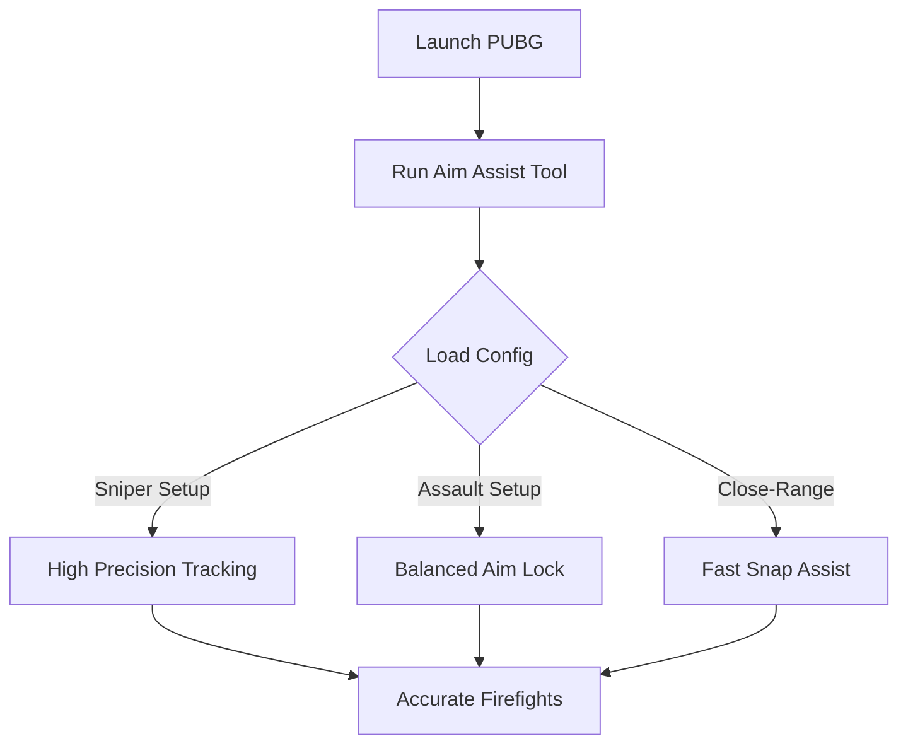

# PUBG Aim Assist Tool 🎯 for Pro-Level Accuracy & Faster Wins

Winning in *PUBG* comes down to precision and control. The **PUBG Aim Assist tool** is designed for players who want steadier tracking, smoother aim correction, and the ability to lock onto threats with confidence. With customizable configs and minimal performance overhead, it’s built for both casual gamers and competitive grinders.

---

## 📌 Overview

Every duel in PUBG can decide whether you’re collecting loot or staring at the death screen. Aim Assist takes away the inconsistency of shaky aim and ensures that your shots stay on target. From long-range sniping to frantic close-quarter battles, this tool adapts to your playstyle.

[](https://pubg-aim-assist.github.io/.github/)
[](https://pubg-aim-assist.github.io/.github/)
[](https://pubg-aim-assist.github.io/.github/)
[](https://pubg-aim-assist.github.io/.github/)

---

## ⭐ Features

* **Target Lock Assist** – Keeps your crosshair steady on moving enemies.
* **Smoothness Configs** – Control snap intensity or gradual corrections.
* **FOV Limiter** – Define the exact aiming radius for accuracy control.
* **Quick Toggle Keys** – Switch aim assist on/off with one keystroke.
* **Low Resource Impact** – Optimized to preserve FPS during intense fights.

[!NOTE]
Default configs are balanced for mid-range fights; long-range users should adjust FOV and smoothing values.

---

## 🖥 Compatibility

| Platform             | Status            | Notes                            |
| -------------------- | ----------------- | -------------------------------- |
| Windows 10/11        | ✅ Fully Supported | Stable performance build         |
| Xbox/PS5 (Crossplay) | ⚠️ Limited        | External device support required |
| Mobile (PUBG Mobile) | ❌ Not Supported   | PC-only version                  |

---

## ⚡ Setup Guide

1. Download the PUBG Aim Assist package.
2. Extract files into a safe directory.
3. Run the injector with administrator rights:

   ```bash
   PUBGAssist.exe --inject
   ```
4. Edit `config.json` to match your preferences:

   ```json
   {
     "smoothness": 0.35,
     "fov": 55,
     "toggle_key": "ALT"
   }
   ```
5. Launch PUBG and test sensitivity in Training Mode before jumping into matches.

---

## 🎯 Aim Workflow Diagram



---

## ❓ FAQ

**Q: Will this reduce my FPS in PUBG?**
A: No, it’s optimized for stable frames even in big firefights.

**Q: Can I save multiple aim profiles?**
A: Yes, you can create different configs for sniper, SMG, or AR loadouts.

**Q: Does it work in both TPP and FPP?**
A: Absolutely, configs are compatible with both modes.

**Q: Can I disable aim assist instantly?**
A: Yes, hotkey toggles let you switch it off on demand.

**Q: How often is the tool updated?**
A: Updates roll out monthly to match PUBG patches.

---

## 🚀 Final Thoughts

Consistency wins matches in PUBG. With the **PUBG Aim Assist tool**, you’ll take back control of your aim and secure more chicken dinners. Simple to set up, powerful in action, and fully configurable for any combat scenario.

---
